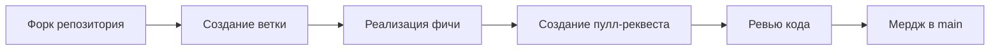

<div align="center">

# GraphicForgeOvorldule 🚧  

**Декларативная C++ библиотека для создания GUI десктопных приложений в стиле Kotlin Compose**  

[](https://t.me/ForgeOfOvorldule)

</div>

```cpp
// Пример будущего синтаксиса (в разработке)
#include <ovorldule.h>

auto ui = Column {
    Text("Добро пожаловать в GraphicForge!"),
    Button("Начать", [] { /* обработка клика */ })
};
```

## 🚧 Текущий статус проекта
<div align="center">
Проект находится на ранней стадии активной разработки. Сейчас мы фокусируемся на:
</div>

- Создании ядра декларативной системы компонентов
- Разработке кроссплатформенного рендеренга через OpenGL
- Построении реактивной системы состояний
- Интеграции с GLFW для управления окнами

<div align="center">

### Технический стек
| Технология       | Назначение                     |
|------------------|--------------------------------|
| C++17            | Основной язык реализации       |
| OpenGL 3.3+      | Графический рендеринг          |
| GLFW 3.3         | Управление окнами и вводом     |
| CMake 3.20+      | Система сборки                 |
| Catch2           | Тестирование (в планах)        |

</div>

## 🔧 Требования для разработки
<div align="center">
Для участия в разработке потребуется:
</div>

- Компилятор C++17 (GCC 9+, Clang 10+, MSVC 2019+)
- CMake 3.20+
- OpenGL 3.3+ совместимая видеокарта
- Библиотека GLFW 3.3

<div align="center">

## 🤝 Как присоединиться к разработке
Приветствуем контрибьютеров! Основные направления работы:
</div>

1. Разработка системы компонентов
2. Реализация OpenGL рендерера
3. Создание платформозависимых слоёв
4. Разработка примеров использования
5. Создание тестовой инфраструктуры

**Требования к коду:**
- Поддержка Windows, Linux и macOS
- Совместимость с C++17
- Чистый и читаемый код

<div align="center">

### Процесс контрибьютинга:


</div>

<div align="center" style="margin: 40px 0;">

## 📬 Обратная связь
Присоединяйтесь к нашему Telegram-чату для обсуждения идей и вопросов:  

[](https://t.me/ForgeOfOvorldule)

</div>

---

<div align="center">
  <a href="https://github.com/Forge-of-Ovorldule/Graphic-Forge-Ovorldule">
    
  </a>
  <a href="https://github.com/Forge-of-Ovorldule/Graphic-Forge-Ovorldule/issues">
    
  </a>
  <a href="https://t.me/ForgeOfOvorldule">
    
  </a>
</div>

<div align="center" style="margin-top: 30px;">

**GraphicForgeOvorldule** - будущее декларативных GUI на C++! 💻✨

</div>
